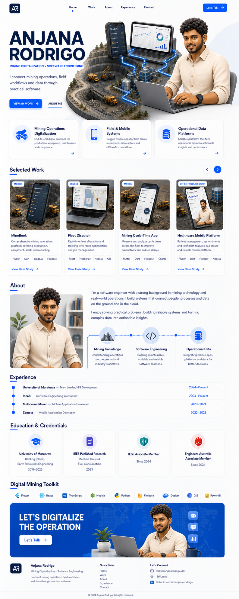

# Anjana Rodrigo Portfolio — Implementation Specification

This document is a build-ready handoff for implementing the supplied portfolio
design as a responsive React website. It is intended to be given directly to
another coding AI or developer.

## 1. Objective

Build a polished, production-ready, single-page portfolio for **Anjana Rodrigo**
that presents him as a software engineer specializing in mining digitalization,
field/mobile systems, and operational data platforms.

The experience should feel:

- Clean and professional
- Premium, friendly, and technically credible
- Visually distinctive through reusable 3D-cartoon assets
- Strongly focused on mining digitalization and software engineering
- Fast, accessible, responsive, and easy to maintain

Do not use the phrases **AI**, **artificial intelligence**, **applied AI**, or
**AI automation** anywhere in the interface or metadata.

Do not flatten the hero into one large screenshot. Construct the page from the
separate transparent PNG assets so they can move and scale responsively.

## 2. Visual reference

Primary full-page reference:



The implementation should closely match the reference's hierarchy and overall
composition while remaining a real, accessible website rather than a pixel-only
reproduction.

## 3. Required technology

- React with TypeScript
- Vite
- Tailwind CSS
- shadcn/ui
- Lucide React for interface icons
- Optional: `react-icons` only for recognizable technology logos
- No CMS or backend is required for the first version

Use the current stable, mutually compatible releases. Follow the official
[Vite React setup](https://vite.dev/guide/),
[Tailwind Vite integration](https://tailwindcss.com/docs/installation/using-vite),
and [shadcn Vite setup](https://ui.shadcn.com/docs/installation/vite).

## 4. Project initialization

Preferred package manager: `pnpm`.

```bash
pnpm create vite@latest anjana-portfolio --template react-ts
cd anjana-portfolio
pnpm install
pnpm add tailwindcss @tailwindcss/vite
pnpm add lucide-react
pnpm add -D @types/node
pnpm dlx shadcn@latest init
pnpm dlx shadcn@latest add button card badge carousel sheet separator tooltip
```

Configure `@tailwindcss/vite` in `vite.config.ts`, add the `@/*` alias to both
Vite and TypeScript configuration, and use:

```css
@import "tailwindcss";
```

in the global stylesheet. The coding AI must verify current official setup
details before installing because package commands can evolve.

## 5. Supplied asset inventory

Copy the following files from this handoff bundle into the new application's
`public/assets` directory. Preserve the filenames.

### Mining assets

| Source file | Destination | Purpose |
|---|---|---|
| `design/assets/transparent/mining/open-pit-mine-diorama.png` | `public/assets/mining/open-pit-mine-diorama.png` | Hero environment and project-card base |
| `design/assets/transparent/mining/haul-truck.png` | `public/assets/mining/haul-truck.png` | Service and mining detail decoration |
| `design/assets/transparent/mining/hydraulic-excavator.png` | `public/assets/mining/hydraulic-excavator.png` | Mining detail decoration |
| `design/assets/transparent/mining/processing-plant.png` | `public/assets/mining/processing-plant.png` | Operational-data visual |

### Software and digital operations assets

| Source file | Destination | Purpose |
|---|---|---|
| `design/assets/transparent/ui/rugged-field-tablet.png` | `public/assets/ui/rugged-field-tablet.png` | MineBook project and hero device |
| `design/assets/transparent/ui/fleet-dispatch-laptop.png` | `public/assets/ui/fleet-dispatch-laptop.png` | Fleet Dispatch project and hero dashboard |
| `design/assets/transparent/ui/mining-cycle-time-phone.png` | `public/assets/ui/mining-cycle-time-phone.png` | Cycle-Time project and hero device |
| `design/assets/transparent/ui/electric-blue-data-network.png` | `public/assets/ui/electric-blue-data-network.png` | Hero connection overlay |

### Avatar assets

| Source file | Destination | Purpose |
|---|---|---|
| `design/assets/transparent/avatar/anjana-with-laptop.png` | `public/assets/avatar/anjana-with-laptop.png` | Hero and final call-to-action |
| `design/assets/transparent/avatar/anjana-portrait.png` | `public/assets/avatar/anjana-portrait.png` | About section |

All supplied images are high-resolution RGBA PNG files with transparent
backgrounds. Do not add white rectangular backgrounds around them.

## 6. Suggested source structure

```text
src/
├── app/
│   └── App.tsx
├── components/
│   ├── layout/
│   │   ├── Container.tsx
│   │   ├── Header.tsx
│   │   ├── MobileNavigation.tsx
│   │   ├── SectionHeading.tsx
│   │   └── Footer.tsx
│   ├── sections/
│   │   ├── HeroSection.tsx
│   │   ├── ServicesSection.tsx
│   │   ├── ProjectsSection.tsx
│   │   ├── AboutSection.tsx
│   │   ├── ExperienceSection.tsx
│   │   ├── EducationSection.tsx
│   │   ├── ToolkitSection.tsx
│   │   └── ContactCtaSection.tsx
│   ├── portfolio/
│   │   ├── ServiceCard.tsx
│   │   ├── ProjectCard.tsx
│   │   ├── ProjectVisual.tsx
│   │   ├── ExperienceRow.tsx
│   │   ├── CredentialCard.tsx
│   │   └── ToolkitBadge.tsx
│   └── ui/
│       └── generated shadcn components
├── data/
│   └── portfolio.ts
├── lib/
│   └── utils.ts
├── styles/
│   └── globals.css
├── main.tsx
└── vite-env.d.ts

public/
└── assets/
    ├── avatar/
    ├── mining/
    └── ui/
```

Keep all repeated content in `src/data/portfolio.ts`. Components should render
from typed arrays rather than duplicating markup.

## 7. Page architecture

Use one semantic page with these sections in this order:

```text
Header
Main
├── Hero
├── Service pillars
├── Selected Work
├── About
├── Experience
├── Education & Credentials
├── Digital Mining Toolkit
└── Contact call-to-action
Footer
```

Section IDs:

```text
home
work
about
experience
contact
```

The header navigation must scroll to these IDs and update the active navigation
state using `IntersectionObserver`.

## 8. Design system

### Colors

Define these as CSS custom properties and expose them through Tailwind:

```css
:root {
  --background: #ffffff;
  --foreground: #071b46;
  --navy: #071b46;
  --navy-muted: #3e4f70;
  --primary: #0868f7;
  --primary-hover: #0457d8;
  --primary-soft: #eaf2ff;
  --cyan: #25b8f4;
  --violet-soft: #f1efff;
  --border: #e4e9f2;
  --surface: #ffffff;
  --surface-muted: #f7f9fc;
  --success: #16a36a;
}
```

The page is predominantly white. Blue is the only strong interface accent.
Use pale blue curved background shapes sparingly in the hero. Avoid heavy
gradients, excessive glassmorphism, neon text, and dark full-page backgrounds.

### Typography

- Primary recommendation: `Manrope` or `Plus Jakarta Sans`
- Fallback: `Inter, ui-sans-serif, system-ui, sans-serif`
- Hero name: `font-black`, uppercase, tight line-height
- Section titles: `font-bold`
- Body: regular weight with comfortable line-height
- Use the navy color for headings and muted navy for body copy

Suggested sizes:

| Element | Mobile | Desktop |
|---|---:|---:|
| Hero name | 48–58 px | 76–92 px |
| Hero body | 17–18 px | 19–21 px |
| Section heading | 28–32 px | 34–40 px |
| Card title | 17–19 px | 18–20 px |
| Body | 15–16 px | 16–17 px |
| Metadata | 12–14 px | 13–14 px |

### Layout

- Maximum content width: `1240px`
- Main horizontal padding: `20px` mobile, `32px` tablet, `40px` desktop
- Section vertical spacing: `72px` mobile, `104px` desktop
- Card radius: `18px`
- Button radius: `10px`
- Card border: `1px solid var(--border)`
- Card shadow: very soft; approximately `0 12px 35px rgba(7, 27, 70, 0.07)`
- Use an 8px spacing system

### Section heading treatment

Each section heading has:

- Navy title
- A short 34–42px blue underline
- Optional small blue circular endpoint
- No large decorative illustrations behind the title

## 9. Header

Desktop:

- Sticky at the top
- 72px high
- White background at approximately 94% opacity with subtle blur
- Fine bottom border
- Left: dark navy rounded-square `AR` monogram
- Center/right: Home, Work, About, Experience, Contact
- Far right: blue **Let's Talk** button with arrow icon
- Active link has a small blue dot beneath it

Mobile:

- Logo on the left
- Compact Let's Talk button may remain visible
- Menu button on the right
- Navigation opens inside shadcn `Sheet`
- Close the sheet after selecting a link

Accessibility:

- Use `<header>` and `<nav aria-label="Primary navigation">`
- Give the menu button an accessible name
- Preserve visible keyboard focus
- Respect `prefers-reduced-motion`

## 10. Hero section

### Copy

Eyebrow:

```text
MINING DIGITALIZATION · SOFTWARE ENGINEERING
```

Heading:

```text
ANJANA
RODRIGO
```

Description:

```text
I connect mining operations, field workflows and data through practical software.
```

Actions:

- Primary: **View My Work** → `#work`
- Secondary: **About Me** → `#about`

### Desktop composition

Use a two-column layout, approximately 38% copy and 62% visual.

The visual is a layered composition inside a `position: relative` container:

1. Add a pale blue organic background shape.
2. Place `open-pit-mine-diorama.png` at the lower center-left.
3. Place `electric-blue-data-network.png` above the mine with reduced opacity.
4. Place `fleet-dispatch-laptop.png` near the upper center.
5. Place `rugged-field-tablet.png` or `mining-cycle-time-phone.png` near the
   upper-left of the visual.
6. Place `anjana-with-laptop.png` on the right as the dominant foreground asset.

Recommended z-index order:

```text
background shape: 0
mine diorama: 10
data network: 20
floating devices: 30
avatar: 40
```

Use `object-contain`, never `object-cover`, for transparent assets. The mine and
avatar must not be clipped at normal desktop widths.

Motion should be restrained:

- Devices may float by 4–6px over 5–7 seconds
- Network glow may gently pulse
- Avatar and mine should remain stable
- Disable decorative motion under `prefers-reduced-motion`

### Mobile composition

- Copy comes first
- Buttons remain above the artwork
- Artwork becomes a stacked composite below the copy
- Hide one floating device if necessary
- Keep the mine, network, and avatar
- Minimum touch target: 44px
- Do not allow horizontal scrolling

## 11. Service pillars

Render three `ServiceCard` components directly below or slightly overlapping the
hero's lower edge.

### Card 1

Title:

```text
Mining Operations Digitalization
```

Description:

```text
End-to-end digital solutions for production, equipment, maintenance and compliance.
```

Icon: mining truck or Pickaxe-style Lucide icon.

### Card 2

Title:

```text
Field & Mobile Systems
```

Description:

```text
Rugged mobile apps for field teams, inspections, data capture and offline-first workflows.
```

Icon: Smartphone.

### Card 3

Title:

```text
Operational Data Platforms
```

Description:

```text
Scalable platforms that turn operational data into actionable insights and performance.
```

Icon: Database.

Each card should include:

- Circular pale-blue icon area
- Title and two-to-three-line description
- Small arrow affordance
- Subtle hover lift and border-color change

## 12. Selected Work

Section ID: `work`.

Use the shadcn `Carousel` on mobile/tablet. On wide desktop, display four cards
in one row while retaining previous/next controls for future projects.

Each card includes:

- 4:3 media region
- Category badge
- Project title
- Short description
- Technology badges
- **View Case Study** text link with arrow

Card links should lead to project detail routes if provided later. Until detail
pages exist, use meaningful placeholders such as `/projects/minebook` and do not
use `href="#"`.

### Project 1 — MineBook

Category: `Mining`

Description:

```text
Comprehensive mining operations platform covering production, equipment, alerts and reporting.
```

Technologies:

```text
Flutter, Dart, Node.js, Firebase
```

Visual composition:

- Mine diorama as low-opacity/background layer
- Rugged field tablet as the dominant foreground layer
- Optional small haul truck near a lower corner

### Project 2 — Fleet Dispatch

Category: `Mining`

Description:

```text
Real-time fleet allocation and tracking with route optimization and job management.
```

Technologies:

```text
React, TypeScript, Node.js, GIS
```

Visual composition:

- Mine diorama as background
- Fleet dispatch laptop as foreground
- Faint blue data-network overlay

### Project 3 — Mining Cycle-Time App

Category: `Mining`

Description:

```text
Measure and analyze cycle times across the fleet to improve productivity and reduce delays.
```

Technologies:

```text
Flutter, Dart, Firebase, Charts
```

Visual composition:

- Mine diorama as background
- Cycle-time phone centered in foreground
- Optional separate haul truck or excavator at 20–30% scale

### Project 4 — Healthcare Mobile Platform

Category: `Other Product Work`

Description:

```text
Patient management, appointments and telehealth features in a secure and reliable mobile platform.
```

Technologies:

```text
Flutter, Dart, Firebase, Node.js
```

Visual composition:

- Use a restrained pale-blue abstract background
- Use `anjana-portrait.png` as a small presenter visual
- Do not reuse the mining scene for this card
- Do not label this project as mining

## 13. About section

Section ID: `about`.

Desktop layout:

- Left 34%: portrait visual
- Right 66%: biography and three expertise pillars

Use `anjana-portrait.png` inside a softly framed panel. Allow the transparent
character to overlap the panel edge slightly. Do not place the portrait inside a
hard circular mask.

### Biography

```text
I'm a software engineer with a strong background in mining technology and
real-world operations. I build systems that connect people, processes and data
on the ground and in the cloud.

I enjoy solving practical problems, building reliable systems and turning
complex data into actionable insights.
```

### Expertise pillars

1. **Mining Knowledge**
   - Understanding operations on the ground and industry workflows.
   - Icon: Mountain or Pickaxe.

2. **Software Engineering**
   - Building maintainable, scalable and reliable software solutions.
   - Icon: Code2.

3. **Operational Data**
   - Integrating mobile apps, platforms and data for better decisions.
   - Icon: Database.

Connect the three desktop pillars with a thin dotted blue line. Remove the
connector on mobile and stack the items vertically.

## 14. Experience section

Section ID: `experience`.

Render a vertical timeline with blue dots on the left and soft bordered rows.
The date stays aligned to the far right on desktop and below the position on
mobile.

| Organization | Role | Date |
|---|---|---|
| University of Moratuwa | Team Leader, MIS Development | 2024–Present |
| Idea8 | Software Engineering Consultant | 2024–Present |
| Melbourne Mover | Mobile Application Developer | 2020–2024 |
| Zomoto | Mobile Application Developer | 2022–2023 |

Content must come from typed data, not hard-coded repeated JSX.

## 15. Education and credentials

Use a four-card desktop grid and a one- or two-column responsive layout.

### University of Moratuwa

```text
BScEng (Hons), Earth Resources Engineering
2018–2023
```

Icon: GraduationCap with blue treatment.

### IEEE Published Research

```text
Machine Hours & Fuel Consumption
2023
```

Icon: FileText with violet treatment.

### IESL Associate Member

```text
Since 2024
```

Icon: ShieldCheck with teal treatment.

### Engineers Australia Associate Member

```text
Since 2024
```

Icon: BadgeCheck with red treatment.

Keep these as factual credentials. Do not invent registration numbers, grades,
awards, publication URLs, or additional qualifications.

## 16. Digital Mining Toolkit

Render compact pill-shaped badges that wrap naturally.

```text
Flutter
React
TypeScript
Node.js
Python
Firebase
Docker
GIS
Power BI
```

Use consistent icon sizing and accessible labels. Avoid a colorful logo wall
that competes with the hero. If `react-icons` is not installed, use Lucide icons
or a small colored dot rather than downloading unverified logo images.

## 17. Contact call-to-action

Section ID: `contact`.

Create a wide blue panel with rounded corners.

Left:

```text
LET'S DIGITALIZE
THE OPERATION
```

Button:

```text
Let's Talk
```

Right:

- Use `anjana-with-laptop.png`
- Add subtle world-map dots using CSS or an inline decorative SVG
- Add three small floating icon tiles: Mail, MessageSquare, BarChart3
- Keep the avatar above the bottom edge without clipping his face or hands

The button should open a `mailto:` link or a verified contact URL. Do not create
a fake contact form submission.

## 18. Footer

Three-column desktop layout:

1. Brand
   - AR monogram
   - Anjana Rodrigo
   - Mining Digitalization · Software Engineering
   - Short one-sentence positioning

2. Quick Links
   - Home
   - Work
   - About
   - Experience
   - Contact

3. Let's Connect
   - `hello@anjanarodrigo.dev`
   - Sri Lanka
   - `linkedin.com/in/anjana-rodrigo`

Treat contact values as configuration. Verify and replace any value that is not
current before production deployment.

Use the current year dynamically:

```tsx
© {new Date().getFullYear()} Anjana Rodrigo. All rights reserved.
```

## 19. Typed content model

Use types similar to:

```ts
export type Service = {
  title: string
  description: string
  icon: React.ComponentType<{ className?: string }>
}

export type Project = {
  slug: string
  title: string
  category: "Mining" | "Other Product Work"
  description: string
  technologies: string[]
  visual: "minebook" | "fleet-dispatch" | "cycle-time" | "healthcare"
}

export type Experience = {
  organization: string
  role: string
  period: string
}

export type Credential = {
  title: string
  subtitle: string
  period: string
  tone: "blue" | "violet" | "teal" | "red"
}
```

Store all copy, URLs, dates, and asset paths in `src/data/portfolio.ts`.

## 20. Component behavior

### `ProjectVisual`

Create the project art from layers rather than separate duplicated images:

```tsx
<div className="relative aspect-[4/3] overflow-hidden rounded-xl bg-slate-100">
  
  
</div>
```

Each decorative image should usually have an empty alt attribute. The card
itself must provide the meaningful project name and description.

### Buttons and links

- Use shadcn `Button` for actions
- Use semantic `<a>` elements for navigation links
- Do not use clickable `<div>` elements
- All arrow icons should use `aria-hidden="true"`
- External links open safely with `rel="noreferrer"`

### Carousel

- Use shadcn Carousel/Embla
- Support touch swipe
- Disable previous/next buttons appropriately
- Buttons need accessible labels
- On desktop, show four cards if space allows
- On tablet show two
- On mobile show approximately 1.1 cards to hint at horizontal movement

## 21. Responsive breakpoints

### Under 640px

- Single-column hero
- Mobile sheet navigation
- One service card per row
- Project carousel shows one card
- About portrait above text
- Experience date moves under role
- Credentials become one column
- CTA stacks content above avatar

### 640–1023px

- Two-column service and credential layouts where space allows
- Project carousel shows two cards
- Hero can use a simplified two-row composition
- Hide one floating hero device if crowded

### 1024px and above

- Full navigation
- Two-column hero
- Three service cards
- Four project cards
- Two-column About layout
- Four credential cards

Test at:

```text
375 × 812
430 × 932
768 × 1024
1024 × 768
1280 × 800
1440 × 900
1920 × 1080
```

## 22. Accessibility requirements

- Conform to WCAG 2.2 AA for the implemented page
- Use semantic landmarks and heading order
- Provide meaningful alt text only when an image conveys information
- Treat purely decorative layered art as `alt=""`
- Minimum 4.5:1 contrast for body text
- Visible focus states on every interactive element
- Keyboard-operable mobile menu and carousel controls
- Include a skip-to-content link
- Do not rely only on color to communicate active state
- Respect reduced motion
- Avoid unexpected focus changes during smooth scrolling

## 23. Performance requirements

- Keep PNGs in their supplied transparent format
- Add explicit `width` and `height` attributes to prevent layout shift
- Eager-load the hero mine and avatar
- Lazy-load assets below the fold
- Use `fetchpriority="high"` only for the dominant hero image
- Avoid rendering multiple full-resolution copies of the same asset
- Use responsive CSS sizing instead of generating low-quality stretched images
- Do not convert transparent assets to JPEG
- Run a production build and eliminate console warnings

Target Lighthouse results on a normal production build:

```text
Performance: 90+
Accessibility: 95+
Best Practices: 95+
SEO: 95+
```

## 24. SEO and metadata

Page title:

```text
Anjana Rodrigo | Mining Digitalization & Software Engineering
```

Meta description:

```text
Portfolio of Anjana Rodrigo, a software engineer building practical mobile,
web and operational data systems for mining and real-world operations.
```

Also add:

- Canonical URL after the production domain is known
- Open Graph title, description, image, and URL
- Twitter card metadata
- Favicon derived from the AR monogram
- `Person` JSON-LD using only verified information

Do not include AI-related keywords.

## 25. Quality and acceptance checklist

The implementation is complete only when all items below pass:

- [ ] Page uses React, TypeScript, Vite, Tailwind CSS, and shadcn/ui
- [ ] All ten supplied transparent assets are copied and referenced correctly
- [ ] Hero is layered from separate assets, not implemented as one screenshot
- [ ] Mining digitalization is the primary visual and written focus
- [ ] Healthcare appears only as an additional project
- [ ] No AI terminology appears anywhere
- [ ] Desktop layout closely matches the supplied reference
- [ ] Mobile layout has no horizontal overflow
- [ ] Header navigation scrolls to the correct sections
- [ ] Active navigation state updates while scrolling
- [ ] Mobile navigation is keyboard accessible
- [ ] Project carousel supports controls and touch swipe
- [ ] All project content comes from typed data
- [ ] Transparent PNGs have no visible green/white boxes
- [ ] Buttons and links have working destinations
- [ ] No fabricated academic or professional information is added
- [ ] Images below the fold lazy-load
- [ ] Reduced-motion preferences are respected
- [ ] `pnpm build` completes successfully
- [ ] TypeScript and lint checks pass
- [ ] No console errors or broken asset requests occur

## 26. Final instruction for the coding AI

Use the following instruction together with this specification:

> Implement the Anjana Rodrigo portfolio exactly as described in
> `PORTFOLIO_IMPLEMENTATION_SPEC.md`. Use React, TypeScript, Vite, Tailwind CSS,
> and shadcn/ui. Copy and use the supplied transparent PNG assets; do not replace
> them with placeholders and do not flatten the page into a screenshot. Match
> the reference's clean white-and-blue visual direction, section hierarchy, and
> professional 3D-cartoon style. Keep mining digitalization and software
> engineering as the central positioning. Healthcare must appear only as an
> additional project. Do not use AI-related wording. Implement all responsive,
> accessibility, interaction, performance, and acceptance requirements. Run the
> build, type checks, linting, and responsive visual checks before reporting the
> work complete.

